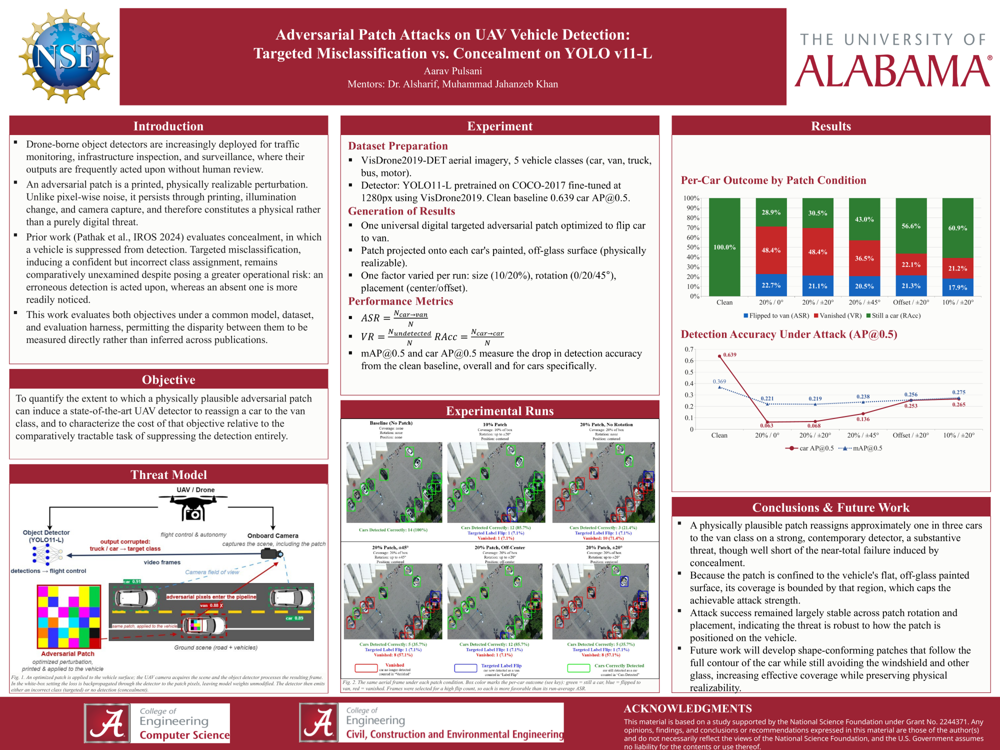

# Adversarial Patch Attacks on UAV Vehicle Detection: Targeted Misclassification vs. Concealment on YOLO11-L

This repository implements universal adversarial patch attacks against a YOLO11-L object detector fine-tuned on VisDrone2019 aerial imagery. It evaluates two distinct adversarial objectives under one model, dataset, and evaluation harness: **targeted misclassification** (forcing a car to be detected as a van) and **concealment** (suppressing the detection entirely). Prior work evaluates concealment; targeted misclassification remains comparatively unexamined despite posing greater operational risk, since an erroneous detection is acted upon whereas an absent one is more readily noticed.

The repository also contains a **roof-constrained placement** extension, in which the patch is geometrically capped to the vehicle's roof so it can never overlap the windshield, rear glass, doors, or mirrors — a stricter physical-realizability constraint than prior "off-glass" formulations.

REU project, University of Alabama. Author: Aarav Pulsani. Mentors: Dr. Alsharif, Muhammad Jahanzeb Khan. Supported by NSF Grant No. 2244371.



---

## Table of Contents

- [Background](#background)
- [Method](#method)
- [Metrics](#metrics)
- [Roof-Constrained Placement](#roof-constrained-placement)
- [Requirements](#requirements)
- [Installation](#installation)
- [Dataset Setup](#dataset-setup)
- [Repository Structure](#repository-structure)
- [Reproducing the Figures](#reproducing-the-figures)
- [Reproducing the Metrics](#reproducing-the-metrics)
- [Results](#results)
- [Reading the Figures](#reading-the-figures)
- [Troubleshooting](#troubleshooting)
- [What Is Not In This Repository](#what-is-not-in-this-repository)
- [References](#references)

---

## Background

Drone-borne object detectors are increasingly deployed for traffic monitoring, infrastructure inspection, and surveillance, where their outputs are frequently acted upon without human review. An adversarial patch is a printed, physically realizable perturbation. Unlike pixel-wise noise, it persists through printing, illumination change, and camera capture, and therefore constitutes a physical rather than a purely digital threat.

**Concealment** (prior work, Pathak et al., IROS 2024) suppresses a vehicle from detection. The failure is conspicuous: an object simply disappears.

**Targeted misclassification** (this work) induces a confident but incorrect class assignment. A car is reported as a van. Downstream systems act on a detection that is present, confident, and wrong.

This repository measures both objectives directly rather than inferring the disparity across publications.

---

## Method

A single **universal** patch is optimized over the training split and then applied unchanged to every car in the evaluation split.

- **Detector**: YOLO11-L, pretrained on COCO-2017, fine-tuned at 1280 px on VisDrone2019. Clean baseline 0.639 car AP@0.5.
- **Classes**: a custom 5-class remap of VisDrone — `0=car, 1=van, 2=truck, 3=bus, 4=motor`.
- **Evaluation resolution**: 640×640.
- **Patch geometry**: a square sized as a fraction of each car's bounding-box area, rotated by a random angle within ±`ROT_DEG`, composited onto the vehicle.
- **Loss**: a margin term plus a hinge term `clamp(TAU − van_logit, 0)` that forces the van logit above the detection threshold, plus total-variation regularization for printability.
- **Object filter**: ground-truth boxes below 0.1% of image area are discarded (`MIN_AREA_FRAC = 0.001`), matching the prior-work convention.

One factor is varied per run: **size** (10% / 20% of the box), **rotation** (0° / ±20° / ±45°), and **placement** (centered / off-center / roof-constrained).

---

## Metrics

Every ground-truth car detected as a car in the clean image is *eligible*. Eligible cars that were **already detected as a van in the clean image** are *ambiguous* and excluded, since a van reading in the patched image cannot be attributed to the patch. On this evaluation set: **9,415 eligible − 457 ambiguous = 8,958**, the strict denominator.

Each non-ambiguous eligible car falls into exactly one outcome, so the three rates sum to 1.0:

| Metric | Definition | Meaning |
|---|---|---|
| **ASR** | `N(car → van) / N` | Attack success. The car is now reported as a van. |
| **VR** | `N(car → undetected) / N` | Vanishing rate. The patch erased a real detection (concealment). |
| **RAcc** | `N(car → car) / N` | Robust accuracy. The detector was unaffected. |

Detection accuracy is additionally reported as **mAP@0.5** across all five classes and **car AP@0.5** specifically, computed with VOC all-points interpolation at IoU 0.5.

> **Operating point.** Saved detections were thresholded at **confidence 0.25 with NMS applied**. The reported AP is therefore taken at a fixed operating point, not a full precision-recall sweep. Values are directly comparable across the runs in this repository, but **not** to published VisDrone leaderboards.

---

## Roof-Constrained Placement

A patch that overlaps glass is not physically deployable: it would obstruct the driver. Standard center placement routinely crosses the windshield and rear glass.

`PLACE_MODE=roof` constrains the patch to the vehicle's central **roof rectangle** — `ROOF_LEN` (default 0.30) of the car's length by `ROOF_WID` (default 0.70) of its width, box-centered — and shrinks the patch until even its *rotated* footprint fits inside that rectangle:

```python
_Lc = max(bwp, bhp); _Wc = min(bwp, bhp)      # car length, width in px
_ext = abs(ct) + abs(st)                       # |cos θ| + |sin θ|
_s_fit = min(ROOF_LEN * _Lc, ROOF_WID * _Wc) / max(_ext, 1e-6)
s = min(s, _s_fit)                             # shrink only, never grow
if s < 4: continue                             # roof too small on this car
```

A square of side `s` rotated by θ has an axis-aligned footprint of side `s·(|cos θ| + |sin θ|)`. Dividing by that factor pre-compensates for rotation, so the fit is **guaranteed by construction** rather than checked empirically — verified at 0.0000 px of overflow across 3,035 boxes.

The cost is size: a requested 20% patch is capped to a realized **~11%** of the box on 99.9% of vehicles. See `ROOFFIT:` lines in the run logs.

---

## Requirements

| Component | Requirement |
|---|---|
| OS | Linux (developed on Ubuntu 24, kernel 6.x) |
| Python | 3.9 or higher |
| GPU | **Not required** for reproducing figures or metrics. Required only to train new patches. |
| Packages | `torch`, `opencv-python`, `numpy`, `ultralytics` (training/eval only) |
| Disk | ~1 GB for the repository, plus ~2 GB for VisDrone imagery |

Reproducing every figure and every metric in this repository is **CPU-only**. The figure scripts never load the detector; they replay saved detections.

---

## Installation

```bash
git clone https://github.com/s155003/visdrone-patch-attacks.git
cd visdrone-patch-attacks

python3 -m venv venv
source venv/bin/activate
pip install torch opencv-python numpy

# only needed to train new patches or run new evaluations
pip install ultralytics
```

---

## Dataset Setup

The **labels are included** in this repository (`datasets/VisDrone/labels/`, 8,629 files) because they are a custom 5-class remap, not the stock VisDrone annotations. The **imagery is not included** (approximately 2 GB) and must be downloaded.

Download VisDrone2019-DET from the [official release](https://github.com/VisDrone/VisDrone-Dataset) and place the JPEGs so the tree looks like this:

```
datasets/VisDrone/
    images/
        test/     <- VisDrone2019-DET-test-dev images
        train/
        val/
    labels/       <- already in this repository
        test/     1,610 .txt
        train/    6,471 .txt
        val/        548 .txt
```

The included labels map stock VisDrone's 10 classes onto 5 vehicle classes and drop the rest:

| Stock VisDrone class | → | This repository |
|---|---|---|
| 3 car | → | 0 car |
| 4 van | → | 1 van |
| 5 truck | → | 2 truck |
| 8 bus | → | 3 bus |
| 9 motor | → | 4 motor |
| 0 pedestrian, 1 people, 2 bicycle, 6 tricycle, 7 awning-tricycle | → | *dropped* |

Class indices in the saved detections depend on this mapping. Substituting stock 10-class labels will silently corrupt every metric.

---

## Repository Structure

```
visdrone-patch-attacks/
    patch_attack_targeted.py            car -> van targeted attack (main script)
    patch_attack_shapes.py              shape / opacity / roof-placement variants
    patch_attack_hide.py                concealment attack
    make_figures_targeted.py            before/after figures, targeted runs
    make_figures_shapes.py              before/after figures, shape+roof runs
    recompute_asr.py                    recompute ASR variants from saved detections

    tools_session/
        ap_and_rates.py                 strict ASR/VR/RAcc + AP@0.5 tables
        render_styled.py                presentation figures (white/red theme)
        render_baseline.py              clean-baseline panels on demand

    patch_examples_<run>/               one directory per run
        results.json                    metrics + full run configuration
        universal_patch.pt              trained patch weights
        universal_patch.png             trained patch, viewable
        <stem>.boxes.json               saved clean + patched detections
        annotated/                      rendered figures (not in repository)

    datasets/VisDrone/labels/           5-class labels (imagery not included)
    yolo11l_visdrone_pretrained.pt      fine-tuned detector
    Figures/                            poster
    visdrone_testdev_10class.yaml       class definitions
    *.log                               training curves / convergence traces
```

### Key runs

| Run directory | Condition |
|---|---|
| `patch_examples_b0_clean` | Clean baseline, no patch |
| `patch_examples_f_rot00` | 20% patch, centered, no rotation |
| `patch_examples_s2b_adv_20_hinge` | 20% patch, centered, ±20° |
| `patch_examples_f_rot45` | 20% patch, centered, ±45° |
| `patch_examples_s2h_center_10` | 10% patch, centered, ±20° |
| `patch_examples_s2d_offset_20` | 20% patch, off-center, ±20° |
| `patch_examples_sh_roof_square` | Roof-constrained square, ~11%, ±20° |
| `patch_examples_sh_roof_circle` | Roof-constrained circle, ~11%, ±20° |

---

## Reproducing the Figures

The figure scripts are **read-only with respect to the detector**. They replay the saved `*.boxes.json` detections and never run YOLO, so no GPU and no model weights are needed.

Ten representative samples from a run, chosen by a fixed seed so the same scenes appear across every run:

```bash
PYTHONPATH=. python make_figures_targeted.py patch_examples_s2b_adv_20_hinge 10 random
```

The full evaluation set (1,360 images, written as `_full.jpg`):

```bash
PYTHONPATH=. python make_figures_targeted.py patch_examples_s2b_adv_20_hinge 0 full
```

Shape and roof-placement runs use the companion script, which reconstructs the correct shape mask and opacity:

```bash
PYTHONPATH=. python make_figures_shapes.py patch_examples_sh_roof_square 10 random
```

Presentation-styled figures (white/red theme, ASR/VR/RAcc legend):

```bash
PYTHONPATH=. python tools_session/render_styled.py all
```

Output is written to `patch_examples_<run>/annotated/`.

> Figures reconstruct the patch pixels for display but read every outcome box from the saved detections. Colors, counts, and metrics therefore reproduce exactly; a patch may render at a slightly different random rotation than an archived JPEG.

---

## Reproducing the Metrics

```bash
PYTHONPATH=. python tools_session/ap_and_rates.py
```

This recomputes, from the saved detections alone with no GPU:

1. Strict ASR / VR / RAcc on the `eligible − ambiguous` denominator, verified to sum to 1.0
2. AP@0.5 per class and overall, at the conf-0.25 operating point

Every metric correction made during this project was recomputed this way. The `*.boxes.json` files are the reason the results remain auditable without re-running the detector.

---

## Results

### Per-car outcome by patch condition

| Condition | ASR (→ van) | VR (vanished) | RAcc (still car) |
|---|---|---|---|
| Clean baseline | 0.000 | 0.000 | 1.000 |
| 20% / 0° | **0.227** | 0.484 | 0.289 |
| 20% / ±20° | 0.211 | 0.484 | 0.305 |
| 20% / ±45° | 0.205 | 0.365 | 0.430 |
| 20% / off-center / ±20° | 0.213 | 0.221 | 0.566 |
| 10% / ±20° | 0.179 | 0.212 | 0.609 |
| Roof square / ~11% / ±20° | 0.157 | 0.248 | 0.595 |
| Roof circle / ~11% / ±20° | 0.142 | 0.262 | 0.597 |

### Detection accuracy under attack

| Condition | mAP@0.5 | car AP@0.5 |
|---|---|---|
| Clean baseline | **0.369** | **0.639** |
| 20% / 0° | 0.221 | 0.063 |
| 20% / ±20° | 0.219 | 0.068 |
| 20% / ±45° | 0.238 | 0.136 |
| 20% / off-center / ±20° | 0.256 | 0.253 |
| 10% / ±20° | 0.275 | 0.265 |
| Roof square / ~11% / ±20° | 0.272 | 0.255 |
| Roof circle / ~11% / ±20° | 0.268 | 0.251 |

### Observations

- A physically plausible patch reassigns roughly **one car in five** to the van class on a strong contemporary detector — a substantive threat, but well short of the near-total failure induced by concealment.
- **Targeted misclassification is markedly harder than concealment.** Under the strongest conditions, VR reaches 0.484 while ASR plateaus near 0.21. Suppressing a detection requires only that the object score fall; producing a *specific* wrong class requires the van logit to rise above threshold, a much narrower target.
- ASR is **remarkably stable across rotation and placement** (0.179–0.227 across every condition), indicating the threat is robust to how the patch is positioned on the vehicle. VR is far more sensitive.
- **Car AP collapses where VR is high** (0.639 → 0.063) because vanished cars are missed detections. Conditions with low VR preserve car AP near 0.25 while retaining ASR above 0.21 — a stealthier attack at equal success.
- **Roof-constrained patches remain effective at roughly half the area.** The roof square reaches ASR 0.157 and car AP 0.255 using a realized ~11% patch, statistically comparable to the unconstrained 10% run, while guaranteeing zero glass overlap.
- Attack strength is bounded by the vehicle's flat painted surface. Coverage cannot exceed that region without sacrificing physical realizability.

---

## Reading the Figures

Each figure is a side-by-side panel: the clean image with its detections on the left, the patched image on the right. Every ground-truth car is boxed by outcome.

| Color | Metric | Meaning |
|---|---|---|
| Blue | ASR | car detected → now reads **van** (attack success) |
| Green | RAcc | car detected → still a car (attack failed) |
| Red | VR | car detected → **erased by the patch** |
| Gray / Yellow | excluded | no clean car to attack: already a van, or never detected |

The distinction between red and gray matters. **Red** marks a car the detector saw correctly and the patch destroyed. **Gray** marks a case that was never a valid target, so it is excluded from the denominator entirely and is not attributable to the patch.

---

## Troubleshooting

**`ModuleNotFoundError: No module named 'patch_attack_targeted'`**

The figure scripts import the attack modules from the repository root. Run them with the root on the path:

```bash
PYTHONPATH=. python make_figures_targeted.py <run_dir> 10 random
```

**`FileNotFoundError` on `datasets/VisDrone/images/test/...`**

The imagery is not in this repository. Download VisDrone2019-DET and place it as shown in [Dataset Setup](#dataset-setup). The labels are already present.

**Figures render but every box is the wrong color, or metrics look wrong**

Stock 10-class VisDrone labels were substituted for the included 5-class labels. Class indices in the saved detections assume `0=car, 1=van`. Restore `datasets/VisDrone/labels/` from this repository.

**The patch is drawn in the wrong place**

`results.json` records `place_mode`, `roof_len`, `roof_wid`, and `rot_deg`; the figure scripts restore them before reconstructing. If you reconstruct manually, restore those fields or a roof run will be drawn at center with the full requested size.

**Shape runs report `strict_asr` but targeted runs report `targeted_asr`**

The two attack scripts use different keys in `results.json`. Read `strict_asr` for shape and roof runs.

**A run shows low ASR *and* low VR**

The patch under-converged. Check the hinge term in the run log: a change of less than roughly −300 from the first to the last epoch means the patch never trained. Small patches, shaped masks, and reduced opacity all shrink the effective gradient. Ellipse, triangle, and reduced-opacity roof runs exhibit this and are labeled accordingly in their figures.

---

## What Is Not In This Repository

| Item | Why | How to obtain |
|---|---|---|
| VisDrone imagery (~2 GB) | Redistributable from source | [VisDrone-Dataset](https://github.com/VisDrone/VisDrone-Dataset) |
| Rendered `_full.jpg` sets (~11 GB) | Fully regenerable | `make_figures_*.py` |
| RetinaNet checkpoints (121–123 MB each) | Exceed GitHub's 100 MB file limit | Retrain via `train_retinanet_v2.py` |

Included and **not** regenerable without this repository: the 127 trained patches, the fine-tuned detector, the 66,840 saved detection files, and the 5-class labels.

---

## References

1. Pathak et al., *Adversarial Patch Attacks on Aerial Object Detection*, IROS 2024
2. Brown, T. et al., *Adversarial Patch*, NeurIPS 2017 Workshop
3. Thys, S., Van Ranst, W., Goedemé, T., *Fooling Automated Surveillance Cameras: Adversarial Patches to Attack Person Detection*, CVPR Workshops 2019
4. Zhu, P. et al., *VisDrone-DET2019: The Vision Meets Drone Object Detection in Image Challenge Results*, ICCV Workshops 2019
5. VisDrone Dataset: https://github.com/VisDrone/VisDrone-Dataset
6. Ultralytics YOLO11: https://github.com/ultralytics/ultralytics

---

## Acknowledgments

This material is based on a study supported by the National Science Foundation under Grant No. 2244371. Any opinions, findings, and conclusions or recommendations expressed in this material are those of the author(s) and do not necessarily reflect the views of the National Science Foundation, and the U.S. Government assumes no liability for the contents or use thereof.
